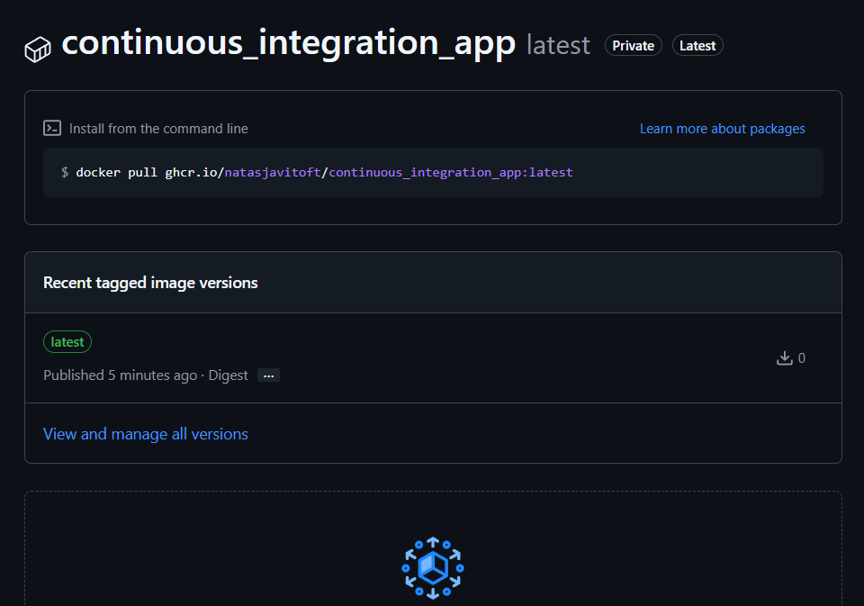
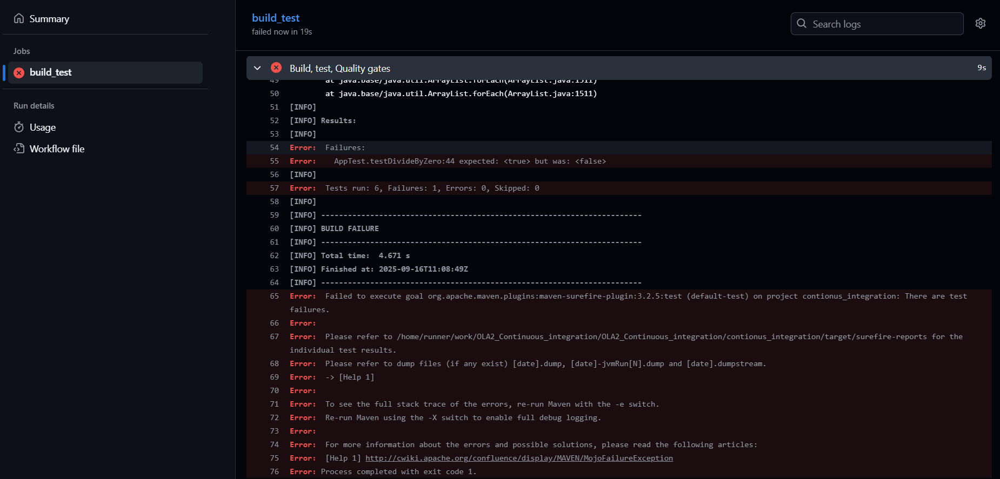
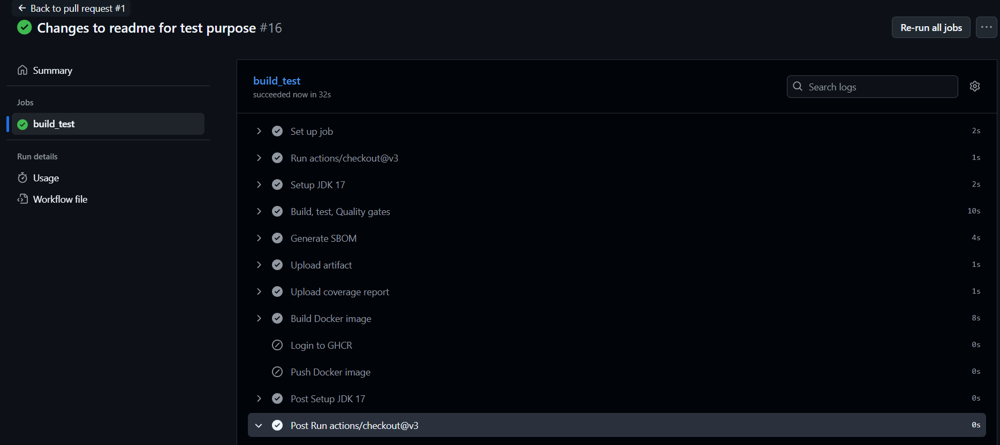

# OLA2: Continuous Integration with Github Actions and Docker

The business logic for this test pipeline is not that interesting and is just some calucation methods for simplicity. 
I have made some unittests for each calucation method to test with the pipeline. 

What i do with the pipeline is that i first: 
* Define the Github workflow and when it should start 
* Setup JDK 17
* I build and test (run all tests from test folder, run jajaco coverage, spotbugs, SBOM)
* I upload artifacts and reports
* I build the docker image 
* I push the docker image

I tested some scenarios for example when a Unittest fails and ensured that the docker images wouldnt be pushed on PR's. 

Repo package: 

Unit test fail:

PR test:

## Sources: 

* https://medium.com/devopsturkiye/pushing-docker-images-to-githubs-registry-manual-and-automated-methods-19cce3544eb1
* https://medium.com/rewrite-tech/how-to-create-custom-ci-cd-with-github-and-docker-495e8ff87c7e

